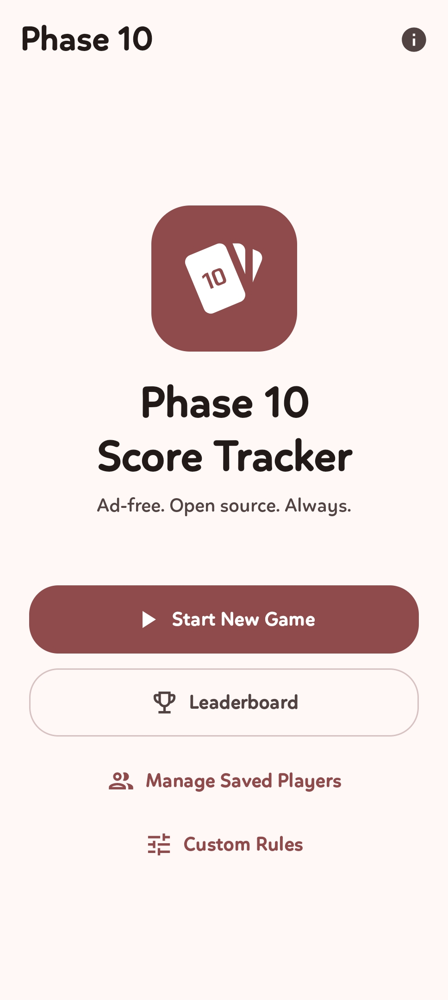
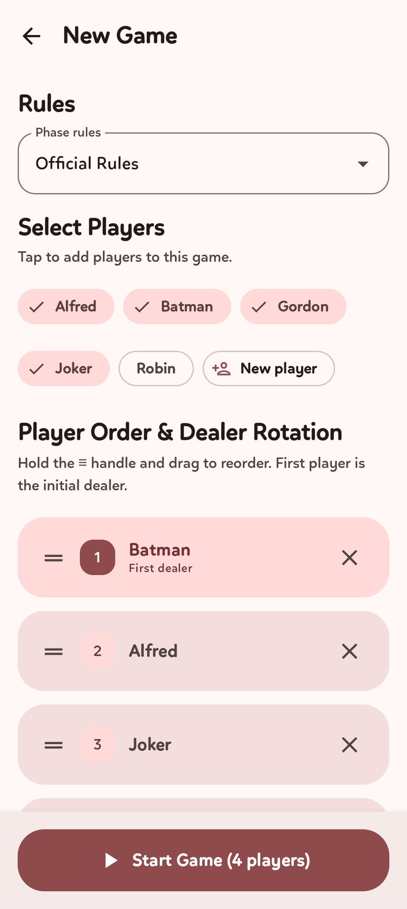
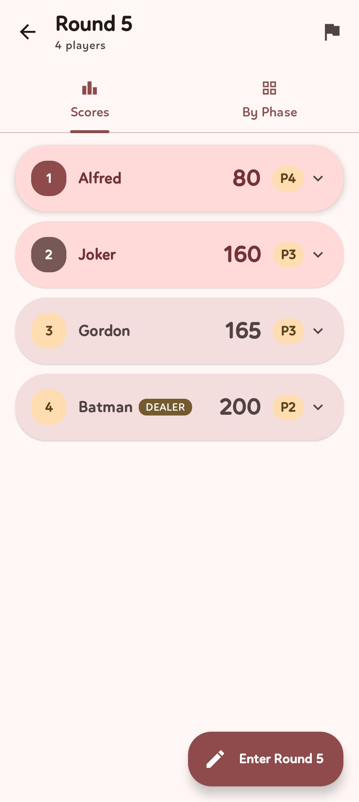
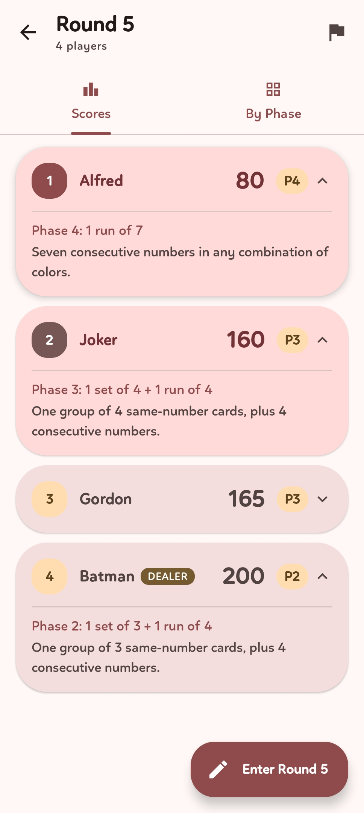
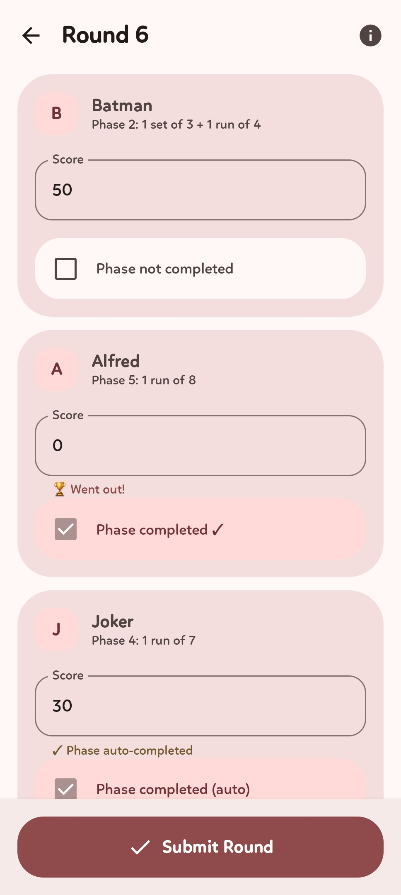
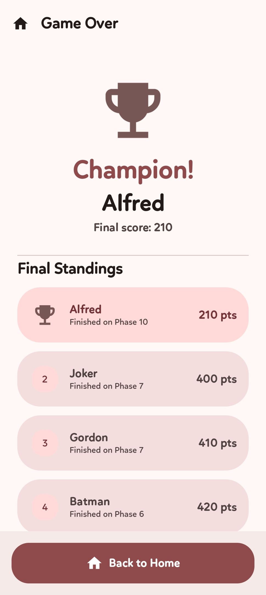
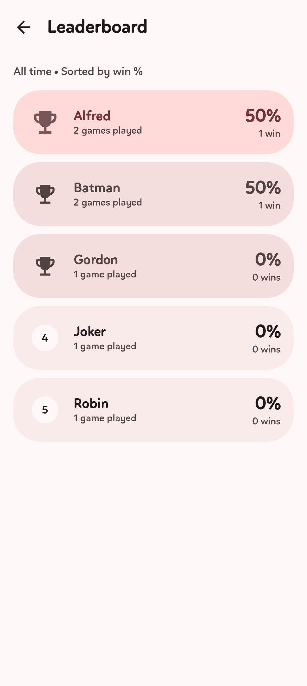
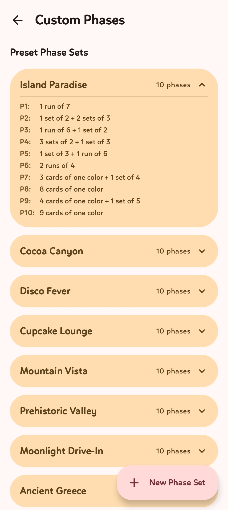
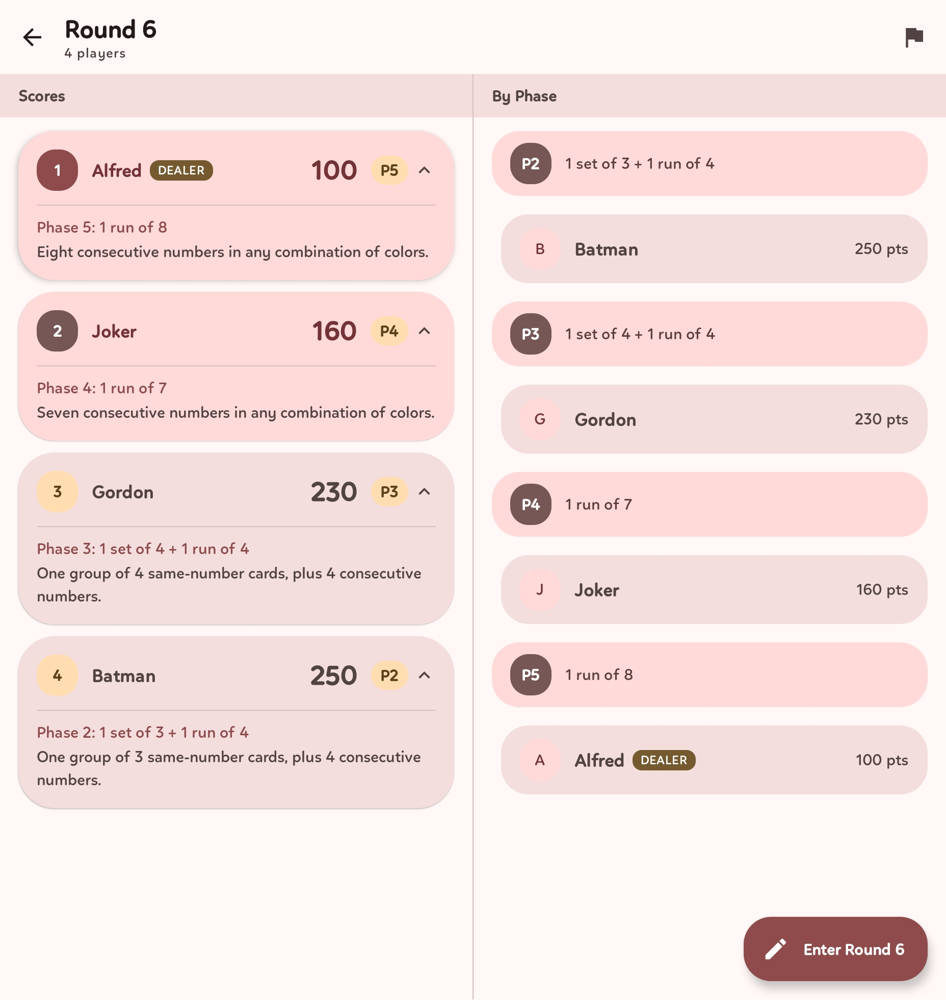

# Phase 10 Score Tracker

An ad-free, open source score tracker for the Phase 10 card game. Built for Android with Jetpack Compose and Material 3 Expressive.

---

## Why This Exists

Every Phase 10 score tracker app on the Play Store falls into one of a few categories: riddled with ads that break on an AdGuard network, so basic they're just a notepad with a counter, or missing obvious features like saving your regular players so you don't have to type the same six names every single game. This one does none of that. It works fully offline, has no ads, no tracking, no analytics, and no nonsense — and it actually remembers who you play with.

---

## Screenshots

<p float="left">
  
  
  
  
</p>

<p float="left">
  
  
  
  
</p>

### Foldable / Tablet — Dual Pane



## Features

### Game Management
- **Saved player roster** — add your regular crew once, pick them from the list every game
- **Flexible game setup** — select any combination of saved players, drag to reorder them before the game starts
- **Dealer rotation** — automatically tracks who the dealer is each round, based on the player order set at game start
- **Resume game** — if the app is killed mid-game (RAM cleared, crash, whatever), your game is saved and waiting when you reopen it
- **End game early** — stop the game at any point; the current leader is declared the winner (highest phase reached, then lowest score as tiebreaker)
- **Tied winner support** — if two players finish on the same phase with the same score, both are declared winners and both get the win recorded
- **Guaranteed winner screen** — completing phase 10 always shows the results; even if the app is killed before you see it, the winner reveal is waiting on next launch

### Scoring
- **Cumulative scoring** — enter card values left in each player's hand at the end of every round; the app adds them up
- **Phase tracking** — each player's current phase advances automatically when they complete a phase
- **Smart phase completion** — a score of 0 (went out) or any value below 50 auto-checks "Phase Completed"; the toggle can be overridden for the rare high-score-but-completed case
- **Mistake-proof round entry** — Submit only enables when every score is filled, every score is a multiple of 5, and exactly one player went out (scored 0), with inline hints for anything off
- **Edit past rounds** — made a mistake three rounds ago? Open Round History from the board, fix any round's scores, and every player's totals and phases are recalculated correctly (with a confirmation summary)
- **Card values reference** — tap ℹ️ on round entry for a reminder (single digits 5pts, double digits 10pts, Skip 15pts, Wild 25pts)

### History, Stats & Privacy
- **Game History** — browse every finished game (winner, players, date, rounds, phase set, winning score)
- **Game Detail** — tap a game for a read-only breakdown: final standings, the exact **date and time** played, and a round-by-round table
- **Leaderboard** — lifetime stats for every saved player: games played, wins, win percentage, sorted by win %
- **Delete a game** — remove a single game from history; the leaderboard is corrected automatically (the winner loses that win)
- **Delete all history & leaderboard** — a one-tap reset that keeps your saved players and any in-progress game
- **Deletes are biometric-protected** — deleting a game, wiping all history, or removing a player requires your fingerprint / device PIN, so a competitive friend can't quietly erase their losses
- **History survives roster changes** — deleting a player keeps their past games (shown as "Deleted Player") and only removes their leaderboard record

### Screens
- **Home** — start / resume a game, Leaderboard, Game History, manage players, custom phases, appearance
- **Game Setup** — pick players, drag to reorder (≡ handle, with haptics), choose a phase set (or roll a random one)
- **Active Game** — live scoreboard with rank badges, dealer badge, and a wavy phase-progress bar per player; a Scores / By Phase toggle (single screen) or both side by side (foldable). Tap a card to see the phase rule
- **Round Entry** — per-player score input with a keyboard-aware layout and a phase-completed toggle
- **Round History** — edit any previous round's scores
- **Game Results** — winner reveal with an expressive trophy, tie support, full standings
- **Game History / Game Detail** — browse and inspect finished games
- **Leaderboard** — lifetime win stats
- **Custom Phases** — create named phase sets; official phases + 14 presets shown for reference
- **About** — credits, links, app version, and the delete-all-data control

### Adaptive Layout
- **Foldable support** — on the Samsung Galaxy Z Fold 6 (and any wide screen), the Active Game shows Scores and By Phase side by side as two cards
- **Seamless transition** — folding / unfolding switches between single and dual pane automatically
- **Tablet ready** — the dual-pane layout activates at ≥ medium width

### Design & Feel
- **Material 3 Expressive** — built exclusively on the latest expressive components (flexible app bars, expressive shapes, connected button groups, wavy indicators) with expressive spring motion
- **Haptic feedback** — subtle, semantic haptics across taps, toggles, scrolling and confirmations, with a Settings toggle to turn it all off
- **Dynamic color** — colors extracted from your wallpaper on Android 12+
- **AMOLED pure black** — optional true-black dark theme
- **Edge to edge** — transparent status and navigation bars with content fading gracefully underneath
- **Dark mode** — full dark theme, follows system or forced light/dark

---

## Tech Stack

| Layer | Library |
|---|---|
| UI | Jetpack Compose |
| Design system | Material 3 Expressive (`material3:1.5.0-alpha21`) + `graphics-shapes` |
| Navigation | Compose Navigation `2.9.8` |
| Database | Room `2.8.4` |
| Auth | `androidx.biometric` (for destructive actions) |
| Reactive state | Kotlin Flow + StateFlow |
| Architecture | MVVM (ViewModel + Repository) |
| Drag reorder | `sh.calvin.reorderable` |
| Adaptive layout | `androidx.compose.material3.adaptive` |
| Build | AGP 9.2.1, Kotlin 2.3.21, KSP 2.3.8 |
| Min SDK | 35 (Android 15) |
| Target SDK | 37 (Android 16) |

---

## Install

[](http://apps.obtainium.imranr.dev/redirect.html?r=obtainium://add/https://github.com/CrsMthw/Phase10-Tracker)

Tapping this button on your Android device will open Obtainium and automatically add the repo — it'll notify you and install new releases automatically from then on.

Or go to the Releases page and download the latest `Phase10Tracker.apk` manually.

---

## Building

Requirements: Android Studio (latest stable), JDK 17+, Android SDK 37.

```bash
git clone https://git.crsmthw.com/crsmthw/Phase10-Tracker.git
cd Phase10-Tracker
# Open in Android Studio and let Gradle sync, or build from terminal:
./gradlew assembleDebug
```

The APK will be at `app/build/outputs/apk/debug/app-debug.apk`.

---

## Official Phase 10 Rules (reference)

| Phase | Rule |
|---|---|
| 1 | 2 sets of 3 |
| 2 | 1 set of 3 + 1 run of 4 |
| 3 | 1 set of 4 + 1 run of 4 |
| 4 | 1 run of 7 |
| 5 | 1 run of 8 |
| 6 | 1 run of 9 |
| 7 | 2 sets of 4 |
| 8 | 7 cards of 1 color |
| 9 | 1 set of 5 + 1 set of 2 |
| 10 | 1 set of 5 + 1 set of 3 |

---

## License

MIT. Do whatever you want with it.

---

*Built with Claude — because the people didn't deserve another ad-infested score tracker.*
